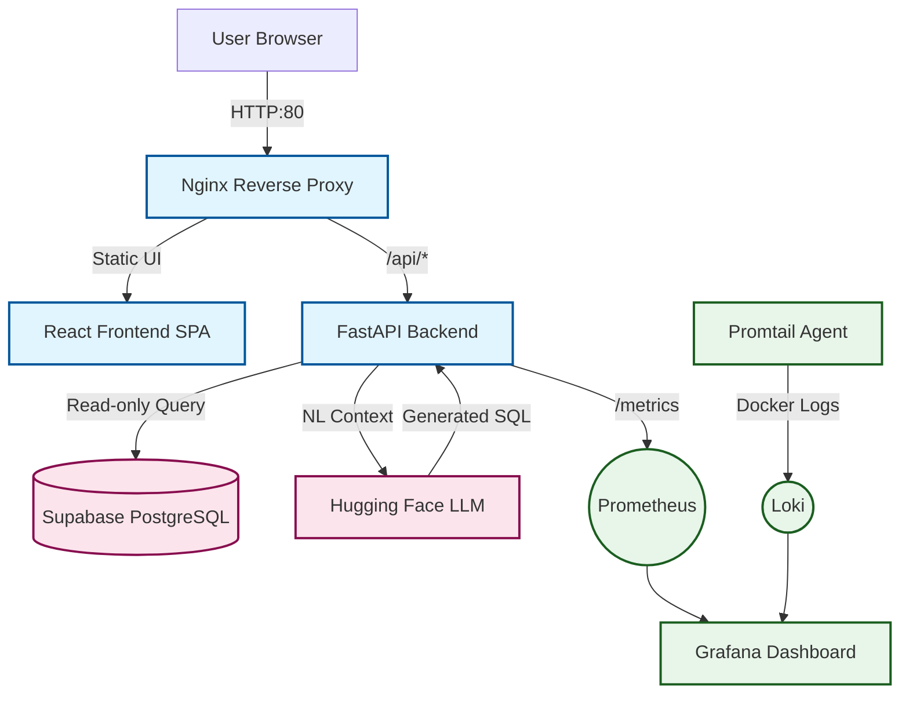

# SupaChat Architecture

SupaChat is a containerized, full-stack application designed to translate conversational queries into SQL analytics, returning interactive data and charts.

## High-Level Diagram

1. **User Interface (Frontend):** React + Vite
2. **API Proxy & LLM Gateway (Backend):** FastAPI
3. **Database:** Supabase (PostgreSQL)
4. **Infra & Monitoring:** Docker Compose, Nginx, Prometheus Stack

<summary><b>Architecture Diagram</b></summary>

```text
                                 [ User Browser ]
                                        | HTTP/80
                                        v
                          +----------------------------+
                          |      Nginx (Reverse Proxy) |
                          +----------------------------+
                               /                   \
                 /api/* routes/                     \ static assets
                             /                       \
             +--------------------+            +-------------------+
             | FastAPI Backend    |            | React Frontend    |
             | (:4000)            |            | (Vite SPA)        |
             +--------------------+            +-------------------+
               |               |
               | SQL Gen       | Read-only Queries
               v               v
  +-----------------+    +-------------------------+
  | Hugging Face    |    | Supabase (PostgreSQL)   |
  | Inference API   |    | DB & Analytics Data     |
  +-----------------+    +-------------------------+

======================== MONITORING BOUNDARY ========================
   [ Promtail ] ----> [ Loki ] <---- [ Grafana :3000 ]
     (Logs)                            |
                                       v
   [ FastAPI /metrics ] ----> [ Prometheus :9090 ]
```


<details>
<summary><b>🌊 View Mermaid Architecture Diagram</b></summary>


</details>

## Project Directory Layout

```text
SupaChat/
├── .github/                 # GitHub Actions CI/CD workflows
├── backend/                 # Python FastAPI server, endpoints, and LLM logic
│   ├── app/                 # Core API routers, models, and middleware
│   └── requirements.txt     # Python dependencies
├── database/                # Supabase schema definitions and seed scripts
│   ├── schema.sql           
│   └── seed.sql             # Generates 120 days of simulated analytics
├── docs/                    # Project architectures and manuals
├── frontend/                # React 19 SPA powered by Vite
│   ├── src/                 # UI components, recharts, and hooks (useChat)
│   └── package.json         
├── monitoring/              # Config files for the observability stack
│   ├── grafana/             # Dashboards and datasources
│   ├── loki/                # Log ingestion configs
│   ├── prometheus/          # Scrape metrics and alert rules
│   └── promtail/            # Container log scraper configs
├── nginx/                   # Reverse proxy configuration files
├── scripts/                 # Server setup shell scripts (nodesource)
├── docker-compose.yml             # Main app container orchestration
└── docker-compose.monitoring.yml  # Observability stack orchestration
```

## Component Breakdown

### Frontend
- **Framework:** React 19 bootstrapped with Vite.
- **Visuals:** Custom Chat UI using Recharts for dynamic graph rendering.
- **State Management:** Custom React hooks (e.g., `useChat.js`) to manage chatbot interaction, generate session IDs, and interface with the backend.

### Backend
- **Framework:** FastAPI running on Python 3.12 via Uvicorn.
- **Responsibilities:** 
  - Expose `/api/chat`, `/api/history`, and `/api/health` endpoints.
  - Proxy requests to Hugging Face Inference API for NL-to-SQL logic.
  - Safely execute generated SQL against Supabase using read-only RPCs.
- **Model Context Protocol (MCP):** Exposes `FastMCP` integration for native LLM IDE querying capabilities.

### Data Layer (Supabase)
- **Role:** Primary persistent storage and analytical engine.
- **Seed Data:** Contains blog analytics (articles, authors, simulated daily traffic data over 120 days).
- **Security:** Queries executed by the LLM are confined to a locked-down, read-only Database Client role to prevent destructive operations.

### Deployment & Reverse Proxy
- **Nginx:** Acts as the main reverse proxy container, routing traffic from port `80` to the FastAPI backend or serving static frontend assets.
- **Docker Compose:** Handles the core application network linking the backend, frontend buildup, and Nginx.
